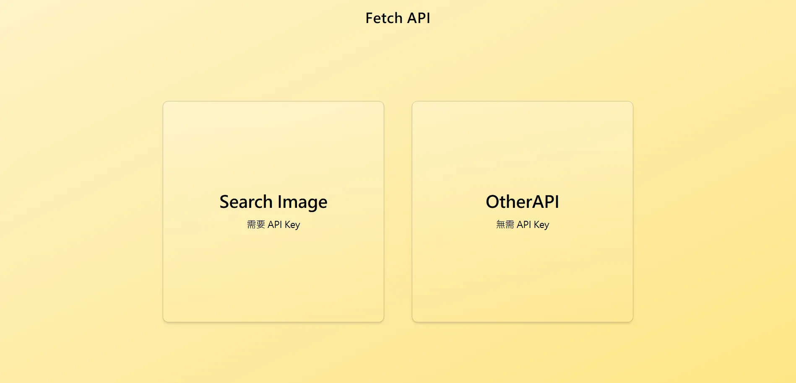
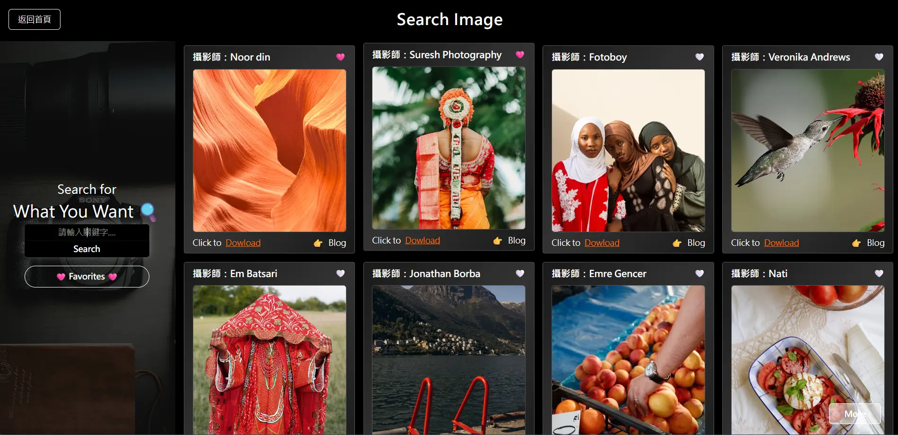
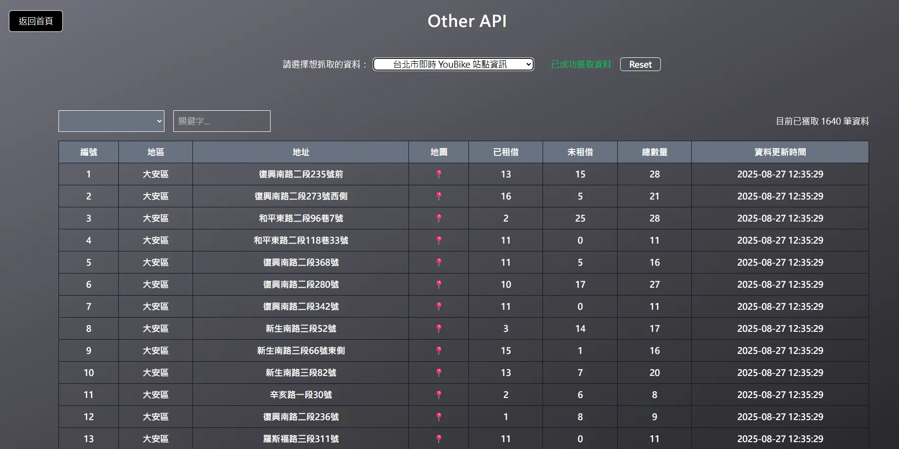
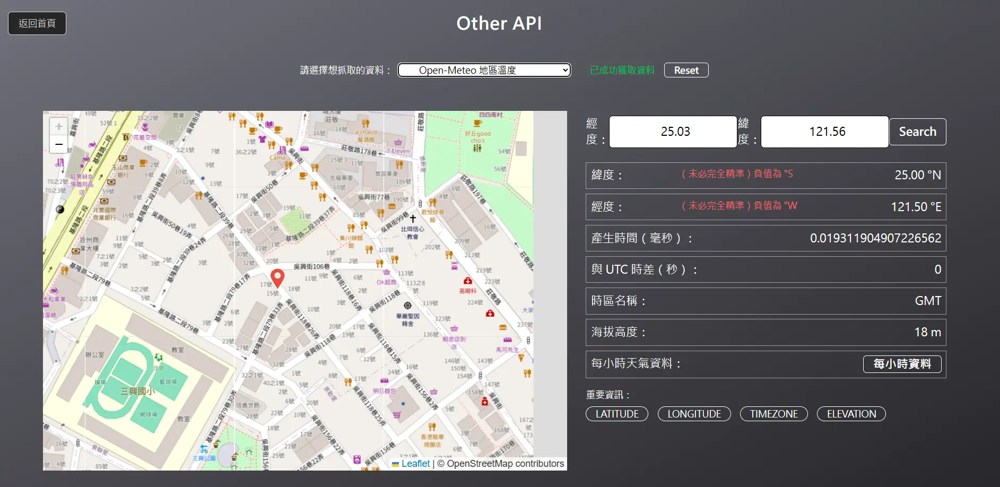

#Fetch API 專案

本專案示範 如何串接多種 API 並在前端呈現資料，包含圖片搜尋與即時資訊查詢。

提供兩種功能模組：

- Search Image（需 API Key）

- Other API（無需 API Key）

---

## Search Image (Pexels API)

使用 Pexels API 搜尋圖片，操作方式：

1. 前往 [Pexels API 官網](https://www.pexels.com/api/) 註冊並取得 API Key
2. 將 API Key 輸入至專案畫面
3. 開始搜尋圖片，即可顯示結果
4. 加入收藏以及下載圖片功能

---

## Other API

此模組整合兩種開放資料來源，不需要 API Key：

###台北市即時 YouBike 站點

- 即時查詢各站點租借情況
- 支援 地區篩選 與 地址查詢，方便快速找到目標站點

###Open-Meteo 地區溫度

- 透過輸入經緯度，查詢當地 每小時 2 公尺高度氣溫
- 點擊地圖地點即可即時獲取當前位置的氣溫

---

##📸 專案特色

- 使用 React + Vite 開發
- Tailwind CSS 美化介面
- 串接多個外部 API，練習 例外處理、狀態管理
- 提供地圖互動、篩選、即時查詢等功能

| 頁面功能               | 畫面截圖                                  |
| ---------------------- | ----------------------------------------- |
| 首頁                   |          |
| Search Image           |  |
| OrtherAPI - Youbike    |       |
| OrtherAPI - Open-Meteo |    |
